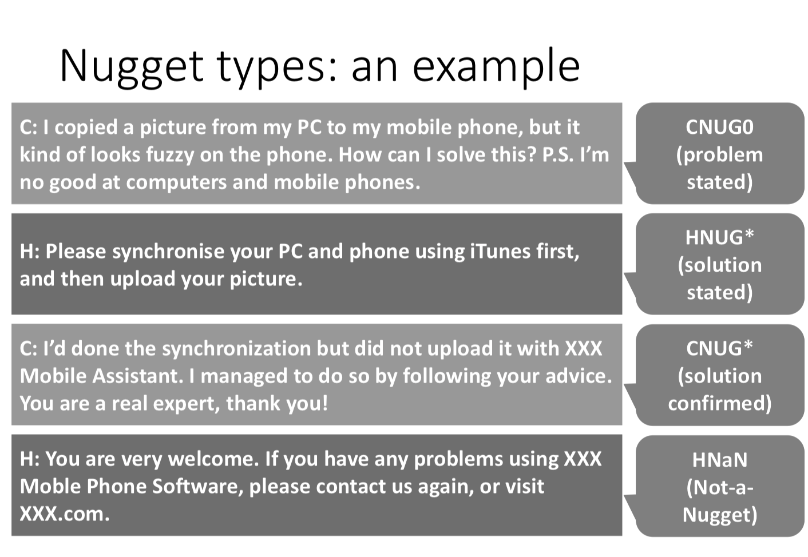

Recently, many reserachers are trying to build automatic helpdesk systems. However, there are very few methods to evaluate such systems. In **STC-3**, we aim to explore methods to evaluate task-oriented, multi-round, textual dialogue systems automatically. This dataset have the following features:

- Chinese customer-helpdesk dialogues carwled from [Weibo](weibo.com).
- English dialgoues: manually translated from a subset of the Chinese dialgoues.
- Nugget type annotatoins for each turn: indicate whether the current turn is useful to accomplish the task.
- Quality annotation for each dialogue. 
  - task accomplishment
  - customer satisfcation
  - dialogue effectiveness 

In this competition, we consider annotations ground truth, and participants are required to predict nugget type for each turn (Nugget Detection, or ND) and dialogue quality for each dialogue (Dialogue Quality, or DQ).

[Download Dataset (2.7 M)](https://github.com/sakai-lab/stc3-dataset/raw/master/data.zip)

[Evaluation Script](https://raw.githubusercontent.com/sakai-lab/stc3-dataset/master/data/eval.py)

[Slides for STC-3 Task (DQ and ND subtasks)](http://sakailab.com/wp-content/uploads/2018/06/STC3atNTCIR-14.pdf ) 

[STC3 Homepage](http://sakailab.com/ntcir14stc3/)

# News
- Sep 3: **Dataset published:**  This [webpage](https://sakai-lab.github.io/stc3-dataset/) has been available.
- Sep 3: **Registration deadline extended:**  We already have 14 registered teams but we have decided to extend the task registration deadline to Sunday 9th Steptember! Please register! Have fun with our new tasks! To register, please click [HERE](http://research.nii.ac.jp/ntcir/ntcir-14/howto.html).


# Dataset Overview
The Chinese dataset contains 4,090 (3,700 for training + 390 for testing)  customer-helpdesk dialgoues which are crawled from [Weibo](weibo.com). All of these dialogues are annotated by 19 annotators.

The English dataset contains 2062 dialogues (1,672 for training + 390 for testing)  are manually translated from a subset of the Chinese dataset. The English dataset shares the same annotations with the Chinese dataset.

### Training Data

 *[train_data_cn.json](https://github.com/sakai-lab/stc3-dataset/blob/master/data/train_data_cn.json)* (3,700 dialogues)

 *[train_data_en.json](https://github.com/sakai-lab/stc3-dataset/blob/master/data/train_data_en.json)* (1,672 dialogues)

### Test Data

*[test_data_cn.json](https://github.com/sakai-lab/stc3-dataset/blob/master/data/test_data_cn.json)* (390 dialogues)

*[test_data_en.json](https://github.com/sakai-lab/stc3-dataset/blob/master/data/test_data_en.json)* (390 dialogues)


### Annotators

We hired 19  Chinese students from the department of Computer Science, Waseda University to annotate this dataset.

# Format of the JSON file

Each file is in JSON format with UTF-8 encoding. 

Following are the top-level fields:

- **id**
- **turns**: array of turns from the customer and the helpdesk (see details below)
- **annotations**: a list of annotations provided by 19 annotators. Each annotation consists of two fields: **nugget** and **quality**

Each element of the turns field contains the following fields:

- **sender**: the speaker of this turn (either customer or helpdesk)
- **utterances**: the utterances (may be multiple) they sent in this turn. Note that some utterances are empty strings since we didn't crawl emoji and photos.

Each element of **annotations** contains the following fields:

- **nugget**: The list of nugget types for each turn (see details below).
- **quality**: A dictonary consists of the subjetive dialogue quality scores: `A`-score, `S`-score, and `E`-score (see details below).


### Nugget Types

- CNUG0: Customer trigger (problem stated)
- CNUG*: Customer goal (solution confirmed)
- HNUG*: Helpdesk goal (solution stated)

- CNUG: Customer regular nugget

- HNUG: Helpdesk regular nugget

- CNaN: Customer Not-a-Nugget
- HNaN: Helpdesk Not-a-Nugget





### Dialogue Quality

- A-score: Task **A**ccomplishment (Has the problem been solved? To what extent?) 

- S-score: Customer **S**atisfaction of the dialogue (not of the product/service or the company) 

- E-score: Dialogue **E**ffectiveness (Do the utterers interact effectively to solve the problem efficiently?) 

Scale: $[2, 1, 0, -1, -2]$


# Evaluation

### Metrics:

During the data annotaiton, we noticed that annotators' assessment on dialgoues are highly subjective and are hard to consolidate them into one gold label. Thus, we proposed to preserve the diverse views in the annotations “as is” and leverage them at the step of evaluation measure calculation.

Instead of juding whether the estimated label is equal to the gold label, we compare the difference between the estiamted distributions $p=\{p(i)\}_{i=1}^L$ and the gold distributions ($p^*=\{p^*(i)\}_{i=1}^L$ calculaed by 19 anntators' annotations). Specifically, we employ these metrics for quality sub-task and nugget sub-task:

- Quality:

  - NMD: Normalised Match Distance. 

    $NMD(p, p^*)=\frac{\sum|cp(i) - cp^*(i)|}{L-1}$ where $cp(i) = \sum_{k=1}^i p(k)$ and  $cp^*(i) = \sum_{k=1}^i p^*(k)$

  - RSNOD: Root Symmetric Normalised Order-aware Divergence

- Nugget:

  - RNSS: Root Normalised Sum of Squared errors

    $RNSS(p, p^*) = \sqrt{\frac{1}{2} \sum (p(i)-p^*(i))^2}$ 

  - JSD: Jensen-Shannon divergence

    $JSD(p, p^*) = \frac{KLD(p||p_m) + KLD(p^*||p_m)}{2}$ 

    where KLD is Kullback-Leibler divergence and $p_m=\frac{p+p^*}{2}$

For the details, please look at [Slides](http://sakailab.com/wp-content/uploads/2018/06/STC3atNTCIR-14.pdf )  and [Metrics](https://waseda.app.box.com/v/SIGIR2018preprint).

###  Test

Once you have a built a model, you may submit it to get official scores on a hidden test set. To preserve the integrity of test results, we do not release the annotations of the test set to the public. Instead, we require you to submit your prediction file. Please put the estimated distributions and the corresponding IDs in a JSON dump file (please refer to [submission_example.json]((https://github.com/sakai-lab/stc3-dataset/blob/master/data/submission_example.json)). For example: 

```json
{
    "id": "3636650070956277",
    "quality": {
      "A": {
        "2": 0.15,
        "1": 0.25,
        "0": 0.3,
        "-1": 0.2,
        "-2": 0.1
      },
      "S": {
        "2": 0.25,
        "1": 0.15,
        "0": 0.3,
        "-1": 0.2,
        "-2": 0.1
      },
      "E": {
        "2": 0.2,
        "1": 0.3,
        "0": 0.25,
        "-1": 0.1,
        "-2": 0.15
      }
    },
    "nugget": [
      {
        "CNUG0": 0.2,
        "CNUG": 0.5,
        "CNUG*": 0.2,
        "CNaN": 0.1
      },
      {
        "HNUG": 0.6,
        "HNUG*": 0.3,
        "HNaN": 0.1
      }
    ]
  },
```


If you are only interested in one subtask (nugget  or  quality), the submission JSON may include only one of them.

### Validation

To tune your model, please use a subset of the training set as a validation set. Since the traning set is not large, K-fold methods are recommended. To calculate metrics for the validtion set, you may use the [evaluation script](https://github.com/sakai-lab/stc3-dataset/blob/master/data/eval.py) to calculate these metrics locally from a prediction file:

```shell
python eval.py submission_example.json train_data_en.json
```


# Citation

```bibtex
@inproceedings{zeng17evia, 
Author = {Zhaohao Zeng and Cheng Luo and Lifeng Shang and Hang Li and Tetsuya Sakai},
Title = {Test Collections and Measures for Evaluating Customer-Helpdesk Dialogues},
Booktitle = {Proceedings of EVIA 2017},
Year = {2017}}
```


# Have questions?

Please contact: [zhaohao@fuji.waseda.jp](mailto:zhaohao@fuji.waseda.jp)        